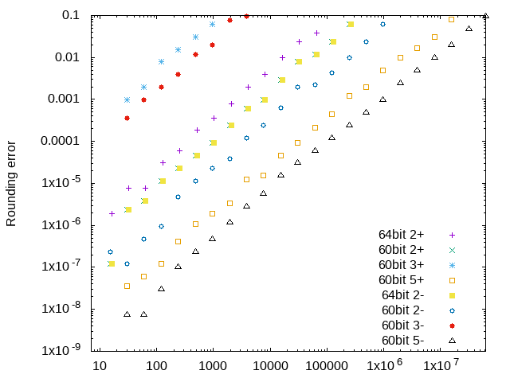
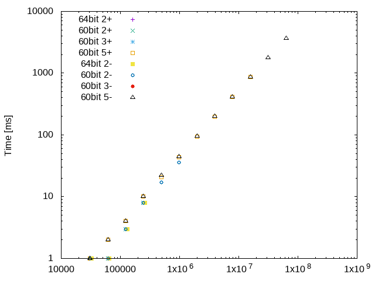

60 bits vs 64 bits
=====

**TL, DR;** 畳み込み乗算をする中で、そもそも64bit整数にどの程度詰め込むと効率的なのかというのを測る実験。

### 問題設定

素直に考えれば64bit整数には64bit詰め込むのが容量的に最適になるのは間違いないのだが、乗算を行う際に

- 4分割16bit

しか現実的に使えそうな選択肢がないので、(整数化誤差による）長さの限界や容量、時間の効率が心配になる。
一方で、もし 60bitずつしか詰め込まなければ

- 3分割20bitずつ
- 4分割15bitずつ
- 5分割12bitずつ

というように選択肢が増えるため、整数化誤差によ長さ限界が伸びることが予想される他、容量や時間の最適化が図れる可能性もある。

そこで本実験では各種実験を通して 64bit 整数に 64bit 詰め込むのが良いのか、60bit 詰め込むのが良いのか比較してみたい。

### 実験内容

以下のような設定で仮想数値を設定しFFTを利用した掛け算をしてみる。入力データとしては整数化誤差が最大になるよう、

- 正方向にだけ正規化するタイプでは (2^b)-1
- 正負の両方に正規化するタイプでは (2^(b-1)-1)

とした。結果として整数化誤差の最大値が0.1を上回るものは実験データとして採用していない。

- 64bit詰め込み前提
  - 1要素あたり16bit、2基底FFT(4基底、8基底を含む)のみ。
- 60bit詰め込み前提
  - 1要素あたり20bit、2基底と3基底(1回)FFT。
  - 1要素あたり15bit、2基底FFTのみ。
  - 1要素あたり12bit、2基底と5基底(1回)FFT。

実験データ n={3,4,5}*2^k の`double`配列の`[0,n/2]`に設定ビット数の乱数をセットすることで、元々2^(k-1)要素で構成された多倍長整数を掛け算することをシミュレートしている。

なお、FFTについては [FFTE](http://www.ffte.jp/) を参考に書き直したコードを利用しているが、[6-step FFT](http://xn--w6q13e505b.jp/method/fft/2dfft.html)は利用していない。
また、FFTを利用した掛け算のシミュレートということで回転子テーブルは1回初期化して3回のFFTで利用している。

### 実験結果

実験コードを走らせると結果が出力される。某マシンでの結果(1 runなので計算時間や計算誤差部分はブレる可能性あり)をlog.txtに置いている。各行で左から

- 計算結果になる多倍長整数の長さ \[Byte\]
- 計算時間 \[ms\]
- FFTする際に何ビットずつ詰めたか
- 2: 2基底FFTのみ、3:3基底を含む、5:5基底を含む
- `double`配列に詰め直す際に +:[0,B)、-:[-B/2,B/2) のどちらの方式で正規化したか
- 整数化誤差の最大値

という風になっている。まず計算誤差を見ると[図1](error.png)のようになっている。正規化は正負の両方に振っている方が約1/4の誤差に落ち着いていることがわかる。また、64bit詰め込み方式では300KB程度の長さの掛け算が限界であるようである。一方60bit詰め込み方式では2基底FFTでも1MB程度の掛け算が可能であり、さらに5基底FFTを利用すれば100MB程度まで行けそうである。ちなみに3基底FFTの利用ではせいぜい3KB程度までの長さであり、あとに見る計算時間では1ms以下の範囲(測定不可)なので実装するメリットは少なそうである。

次に計算時間を見ると[図2](time.png)のようになっている。2基底FFTが使える範囲ではデータ長の違いもあり、2基底FFTが最速である。次点で5基底FFTを用いたものが約4/3倍の時間を要している。60bit詰めと64bit詰めの差はほぼ見られない。が、これはデータ長16/15のメリットがあるだけなのでその隙間に入るデータがどの頻度で来るかとのトレードオフである。

## 結論

これまでの計算実験から、計算が200KBまでに収まることが事前にわかっている場合は64bitずつ詰めて計算することが可能そうである。
一方それ以上の桁の計算をする場合は60bitずつ詰めるのが良いと思われる。より具体的には100MB程度の長さの掛け算では15bitずつに4分割して2基底FFTを使い、それ以上の長さの計算では12bitずつに5分割して5基底FFTを導入すると良い。

TODO: 2段階FMT (Schonhage-Strassen) の導入でどの程度までの桁の計算が可能か求める。
